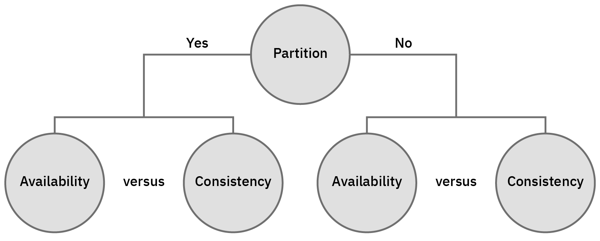

# Choosing the right Database:

https://www.youtube.com/watch?v=Rk0h7Jd1WGQ

https://www.youtube.com/watch?v=KWOSGVtHWqA

Introduction of NO SQL 
https://www.youtube.com/watch?v=qI_g07C_Q5I

Intro to cassandra
https://www.youtube.com/watch?v=B_HTdrTgGNs

Comparing Cassandra with other NO SQL DB, feature wise .
https://www.youtube.com/watch?v=G8xHwnCevYo

Basic intro of most  NO SQL DB
https://www.youtube.com/watch?v=K4Ve9BvUJBk

Distributed Systems in One Lesson
https://www.youtube.com/watch?v=Y6Ev8GIlbxc

### ETL vs ELT 
https://www.youtube.com/watch?v=voC0ewDeltA

ETL :
  Extract normlized data then Transform the normalized data into a denormalized structure and then Load it into DWH

ELT: 
 Extract normalized data then Load the normalized data into DWH and then Transform normalized data into denormalized structure or report.

ETL | ELT
------------ | ------------ 
Since Transformed data gets loaded in DWH some data can get lost either by not being part of transformation or because of irreversible transformation | Since normalized data gets Loaded hence no data gets lost any kind of denormalized report or structure can be built
Mostly part of legacy systems | Cloud ecosystem favours this kind pattern, as destination system features such as elastic compute can be used to its advantage no matter the size of the data
Adhoc or dynamic requests would need change in the pipeline | Adhoc or dynamic requests can be handled seperately and source data has already been loaded

https://www.youtube.com/watch?v=8DI6qPlCXT0

### Database VS Data Warehouse VS Data Lake
https://www.youtube.com/watch?v=WgIbvkyY4mI

Database  : Mostly deals with transactional data and what is the state of any application at that moment. 

Data Warehouse : Has both historical as well as latest data  and reports can be generated to give historical perspective . For eg. a X sold 50 items when he was slaesman and then gets promoted as sales manager and makes 100 sales . These kind of reports can be generated from DWH 

Data Lake : It has historical data both in structured and non structured format. So its bascially DWH with non structured data.

## SCD ( Slowly changing dimensions/data )

Usually SCD 1 and 2 are popular but SCD 0 and 3 can also be used in some cirumstances.

### Type 0 ( No update )
The Type 0 dimension attributes never change and are assigned to attributes that have durable values or are described as 'Original'. Examples: Date of Birth, Original Credit Score. Type 0 applies to most date dimension attributes.

In type 0 preserve the original value, when the attribute changes in source operational system are not going to change in the data warehouse. In above example, Sahan has moved his location from Kandy to Colombo. But DimCustomer keep the original value as Kandy.

### Type 1 ( Update with current value without any history )
When update occur in the source system, update the dimension member accordingly. In the example we considered similar to the source table, DimEmployee also changed Sahan's location as Colombo.

### Type 2 ( Update current value along with maintianing history )
Type 2 allows to store history of changes of your data. Additionally two date-time columns introduced for row versioning and another Boolean column for state the current record. As per the example now new record has inserted for DimEmplotee and mark it as current. Previous record update as not the current and updated the expire date too.

### Type 3 ( Update with limited history mostly current and previous )
Support only for limited history. Actually, type 3 is less popular in Data Warehouse development. So, there is another column called current location. Now we have two columns for current location and previous location.

### Type 4 ( keep the current value in one table and maintian history in another one )
Quite similar to the type 2. But another table has introduced for maintain history records. So, when sahan moved to Colombo the current record is updated in Current DimEmployee table and the older version moved to History table

Note : https://github.com/cartershanklin/hive-scd-examples

## CDC  ( Change Data Capture )
The ability to capture only the changed source data and to move it from a source to a target system(s) is known as Change Data Capture (CDC).

## SCD VS CDC
CDC is used to extract
SCD is used to update

## Types of Schema in DWH
https://www.youtube.com/watch?v=lWPiSZf7-uQ

- Dimension Table : Dimension table offers descriptive characteristics of the facts with the help of their attributes. For eg: A product table will contian the various attributes of product along with a product ID.

- Fact Table : A Fact Table contains

  - Measurements/facts
  - Foreign key to dimension table

For eg. An order table will contain a FK of product and measurements such as its quantity .

### 3NF
- first normal form, ensures that every column attribute only holds one value.
- second normal form, ensures that every column is dependent on the primary key, or more specifically that the table serves a single purpose.
- third normal form, ensures that non-key attributes are dependent on nothing but the primary key. The more technical explanation involves "transitive dependencies" .

normalization helps ensure:

    Data is not unnecessarily repeated within a database.
    Inserts, modifications, and deletions only have to happen once in a database.

Link : https://dzone.com/articles/third-normal-form-star-schema-and-a-performance-ce

### Star Schema
https://www.youtube.com/watch?v=KUwOcip7Zzc

Link : https://docs.oracle.com/cd/B10500_01/server.920/a96520/schemas.htm

### Snowflake Schema

Star Schema | Snowflake Schema 
------------ | ------------ 
Dimension table is not normalized | Dimension table is normalized
Data consistency can be an issue  | Since Dimension tables are normalized hence data consistency is not and issue
Star schema uses more space. |	 it uses less space. 
It has high data redundancy. |	Whle it has less data redundancy.
It takes less time for the execution of queries. |	 it takes more time than star schema for the execution of queries.

## Special Data Types 

###Geospatial
Types of geoSpatial objects
    Point
    LineString
    Polygon
    MultiPoint
    MultiLineString
    MultiPolygon
    GeometryCollection

To generate GeoJson http://geojson.io/ , 

GeoSpatial operations
  - nearSphere
  - geoWithin
  - geoIntersects
  
https://www.youtube.com/watch?v=V8LNyiBACLo

Temporal -->a temporal database can establish at what times certain entries are accurate. alternative SCD
Time series -->

## Distributed System:
https://www.youtube.com/watch?v=Y6Ev8GIlbxc

- Sharding:

- Consisteny :

  - Eventual consistency:

### CAP Theorem
In distributed systems ?

https://medium.com/swlh/cap-theorem-in-distributed-systems-edd967e7bdf4

### PACELC (pass-elk) theorem
It highlights how CAP theorm only talks about failures .

A more complete portrayal of the space of potential consistency tradeoffs for DDBSs can be achieved by rewriting CAP 
as PACELC (pronounced “pass-elk”): if there is a partition (P), how does the system trade off availability and
consistency (A and C); else (E), when the system is running normally in the absence of partitions, how does the 
system trade off latency (L) and consistency (C)? 

https://www.cs.umd.edu/~abadi/papers/abadi-pacelc.pdf

In simple terms : In failure scenarioes when partition (P) arises then we will have to choose between availability and consistency ( A and C ) but in else ( E ) condition i.e normal scenario we will have to choose between latency and consistency ( L and C )

### CQRS (Command Query Responsibility Segregation )
https://www.youtube.com/watch?v=uTCKzPg0Uak

Seperate read and write seperately. Its mostly used in micro-services and event based services.

## NoSQL
( Introduction to NoSQL • Martin Fowler )  https://www.youtube.com/watch?v=qI_g07C_Q5I 

Types of NoSQL DB
1. Key Value
2. Document
3. Column Family
4. Graph

high availability
redundancy
scalable
