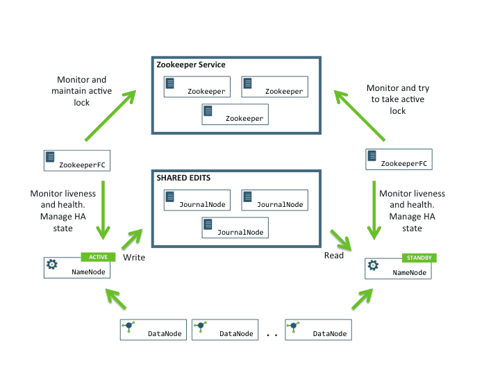
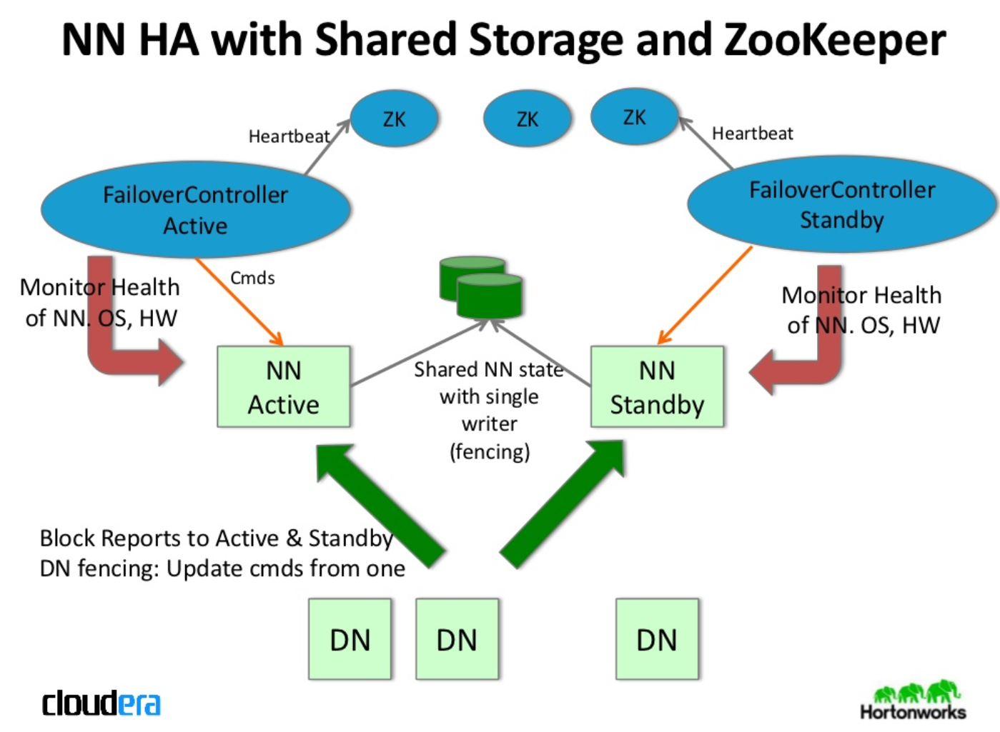
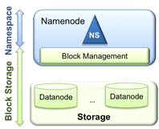
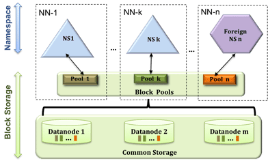
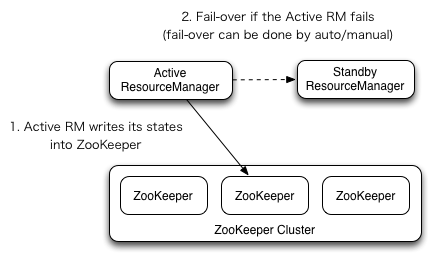
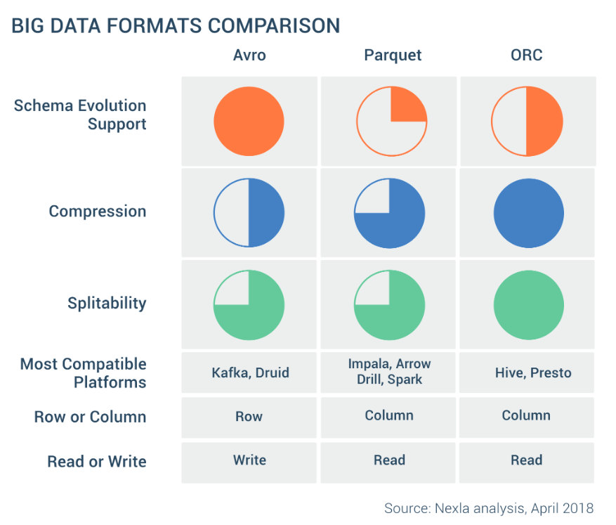

#Hadoop

##HDFS

### HDFS Components
> Data Node
> Name Node
> Secondry Name Node
> Stadby Name Node

### NameNode High Availability
NameNode HA gives following benefit:
>Hot Standby: Both Active and Standby NameNodes have up to date HDFS metadata, ensuring seamless failover even for large clusters – which means no downtime for your cluster!

>Automated Failover: It pro-actively detects NameNode host and process failures and will automatically switch to the standby NameNode to maintain availability for the HDFS service. 

Note that, in an HA cluster, the Standby NameNode also performs checkpoints of the namespace state, and thus it is not necessary to run a Secondary NameNode, CheckpointNode, or BackupNode in an HA cluster. In fact, to do so would be an error. This also allows one who is reconfiguring a non-HA-enabled HDFS cluster to be HA-enabled to reuse the hardware which they had previously dedicated to the Secondary NameNode. [From Hadoop Doc](https://hadoop.apache.org/docs/stable/hadoop-project-dist/hadoop-hdfs/HDFSHighAvailabilityWithQJM.html#Note:_Using_the_Quorum_Journal_Manager_or_Conventional_Shared_Storage)

When ZooKeeper is used in conjunction with QJM or NFS, it enables automatic failover.
Active and Standby NameNode configuration can be done in following two ways:
1. Using Quorum Journal Nodes
2. Shared Storage using NFS

##### 1. Using Quorum Journal Nodes :
- The standby NameNode and the active NameNode keep in sync with each other through a separate group of nodes called JournalNodes. The JournalNodes follows the ring topology where the nodes are connected to each other to form a ring. The JournalNode serves the request coming to it and copies the information(EditLogs) into other nodes in the ring.This provides fault tolerance in case of JournalNode failure. 
- The active NameNode is responsible for updating the EditLogs (metadata information) present in the JournalNodes.
- The StandbyNode reads the changes made to the EditLogs in the JournalNode and applies it to its own namespace in a constant manner.
- During failover, the StandbyNode makes sure that it has updated its meta data information from the JournalNodes before becoming the new Active NameNode. This makes the current namespace state synchronized with the state before failover.
- The IP Addresses of both the NameNodes are available to all the DataNodes and they send their heartbeats and block location information to both the NameNode. This provides a fast failover (less down time) as the StandbyNode has an updated information about the block location in the cluster. [QJM Design](https://hortonworks.com/blog/namenode-high-availability-in-hdp-2-0/)

##### 2. Using Shared Storage:
- The StandbyNode and the active NameNode keep in sync with each other by using a shared storage device. The active NameNode logs the record of any modification done in its namespace to an EditLog present in this shared storage. The StandbyNode reads the changes made to the EditLogs in this shared storage and applies it to its own namespace.
- Now, in case of failover, the StandbyNode updates its metadata information using the EditLogs in the shared storage at first. Then, it takes the responsibility of the Active NameNode. This makes the current namespace state synchronized with the state before failover. [Shared Storage Design](https://www.slideshare.net/cloudera/hadoop-world-2011-hdfs-name-node-high-availablity-aaron-myers-cloudera-sanjay-radia-hortonworks)

Shared storage on NFS was practical for some organizations, but difficult for others beacuse of :
- Complex configuration, custom fencing scripts 
- Filer itself must be highly available 
- Expensive to buy, expensive to support 
- Buggy NFS clients in Linux

Hence, QJM was introduced and is preferred. [Strata + Hadoop World 2012: HDFS: Now and Future](https://www.slideshare.net/cloudera/hdfs-futures-world2012-widescreen)

##### Automatic Failover for HA :

Apache Zookeeper is a service that provides the automatic failover capability in HDFS High Availabilty cluster. It maintains small amounts of coordination data, informs clients of changes in that data, and monitors clients for failures. Zookeeper maintains a session with the NameNodes. In case of failure, the session will expire and the Zookeeper will inform other NameNodes to initiate the failover process. In case of NameNode failure, other passive NameNode can take a lock in Zookeeper stating that it wants to become the next Active NameNode.

The ZookeerFailoverController (ZKFC) is a Zookeeper client that also monitors and manages the NameNode status. Each of the NameNode runs a ZKFC also. ZKFC is responsible for monitoring the health of the NameNodes periodically.

##### Manual Transition from Active to Stadby NameNode

HDFS admin commands ***transitionToActive and transitionToStandby*** helps in transitioning the state of the given NameNode to Active or Standby

These subcommands cause a given NameNode to transition to the Active or Standby state, respectively. These commands do not attempt to perform any fencing, and thus should rarely be used. Instead, ***one should almost always prefer to use the “hdfs haadmin -failover” subcommand.***

HDFS admin *failover* command initiates a failover between two NameNodes

This subcommand causes a failover from the first provided NameNode to the second. If the first NameNode is in the Standby state, this command simply transitions the second to the Active state without error. If the first NameNode is in the Active state, an attempt will be made to gracefully transition it to the Standby state. If this fails, the fencing methods (as configured by dfs.ha.fencing.methods) will be attempted in order until one succeeds. Only after this process will the second NameNode be transitioned to the Active state. If no fencing method succeeds, the second NameNode will not be transitioned to the Active state, and an error will be returned.

Also, important to note is the "split brain problem" while achieving HA i.e when both node starts updating the EditLog. 

It is desirable for correctness of the system that only one NameNode be in the Active state at any given time. Importantly, when using the Quorum Journal Manager, only one NameNode will ever be allowed to write to the JournalNodes, so there is no potential for corrupting the file system metadata from a split-brain scenario. However, when a failover occurs, it is still possible that the previous Active NameNode could serve read requests to clients, which may be out of date until that NameNode shuts down when trying to write to the JournalNodes. For this reason, it is still desirable to configure some fencing methods even when using the Quorum Journal Manager. However, to improve the availability of the system in the event the ***fencing mechanisms*** fail, it is advisable to configure a fencing method which is guaranteed to return success as the last fencing method in the list. Note that if you choose to use no actual fencing methods, you still must configure something for this setting, for example “shell(/bin/true)”.

### HDFS Federation
Issues in previous design

>Namespace scalability : While HDFS cluster storage scales horizontally with the addition of datanodes, the namespace does not. Currently the namespace can only be vertically scaled on a single namenode.  The namenode stores the entire file system metadata in memory. This limits the number of blocks, files, and directories supported on the file system to what can be accommodated in the memory of a single namenode.

>Performance : File system operations are limited to the throughput of a single namenode, which currently supports 60K tasks. 

>Isolation : The cluster is used in a multi-tenant environment where many organizations/department  share the cluster. A single namenode offers no isolation in this setup. A separate namespace for a tenant is not possible. 

##### HDFS Federation

In order to scale the name service horizontally, ***federation uses multiple independent namenodes/namespaces***. The namenodes are federated, that is, the ***namenodes are independent*** and don’t require coordination with each other. The datanodes are used as common storage for blocks by all the namenodes. Each ***datanode registers with all the namenodes*** in the cluster. 

A ***Block Pool*** is a set of blocks that belong to a single namespace. Datanodes store blocks for all the block pools in the cluster.

A Namespace and its block pool together are called Namespace Volume. It is a self-contained unit of management. When a namenode/namespace is deleted, the corresponding block pool at the datanodes is deleted. 

#### HDFS Snapshots

### HDFS commands

## YARN

### YARN Components

#### YARN HA

https://www.youtube.com/watch?v=4rCyaenGxwE
https://www.slideshare.net/Hadoop_Summit/t-525p230-ckambatla

When YARN was initially created, its ResourceManager represented a single point of failure—if NodeManagers lost contact with the ResourceManager, all jobs in progress would be halted, and no new jobs could be assigned.

Hadoop 2.4 improved YARN’s resilience with the release of the ResourceManager high-availability feature. The new feature incorporates ZooKeeper to allow for automatic failover to a standby ResourceManager in the event of the primary’s failure.

Like HDFS, YARN uses a similar, ZooKeeper-managed lock to ensure only one ResourceManager is active at once. ***Unlike HDFS, YARN’s automatic failover mechanism does not run as a separate process—instead, its ActiveStandbyElector service is part of the ResourceManager process itself.*** Like ZKFailoverController, the ActiveStandbyElector service on each ResourceManager continuously vies for control of an ephemeral znode, ActiveStandbyElectorLock. Because the node is ephemeral, if the currently active RM allows the session to expire, the RM that successfully acquires a lock on the ActiveStandbyElectorLock will automatically be promoted to the active state. [Link](https://www.datadoghq.com/blog/hadoop-architecture-overview/#yarn-and-zookeeper)

###### ResourceManager HA in YARN
***ResourceManager HA*** is realized through an Active/Standby architecture.

At any point of time, one of the RMs is Active, and other standby node is waiting to take over if Active RM fails.

The RM being promoted to an active state loads the RM internal state from State-store and continues to operate from where the previous active left off.

A new attempt is spawned for each managed application previously submitted to the RM. Applications can checkpoint periodically to avoid losing any work.

The ***State-store*** must be visible from the both of Active/Standby RMs. Currently, there are two RMStateStore implementations for persistence - ***FileSystemRMStateStore and ZKRMStateStore.***

The ZKRMStateStore (ZooKeeper) implicitly allows write access to a single RM at any point in time, and hence is the recommended store to use in an HA cluster.

Using the *ZKRMStateStore*, there is no need for a separate fencing mechanism to address a potential split-brain situation where multiple RMs can potentially assume the Active role.This situation is handled with ZooKeeper very well.

***After Hadoop 2.x and Before Hadoop 2.6.x:***

When a ResourceManager dies and is restarted, or fails over to another ResourceManager in the case of an HA cluster, the newly active ResourceManager instructs running ApplicationMasters to abort. This uses up an application attempt.

Also, if the ResourceManager is down for some time and the ApplicationMaster is unable to connect, it will timeout and abort. That uses up an application attempt too.

When a new ResourceManager becomes active, it can recover applications with failed attempts that have not exceeded their max-attempts.

Have a look at this [article](https://blog.cloudera.com/blog/2014/05/how-apache-hadoop-yarn-ha-works/) for more details

***From Hadoop 2.6.0:***

Resource Manager recovers its running state by taking advantage of the container statuses sent from all Node Managers. Node Manager will not kill the containers when it re-syncs with the restarted Resource Manager.

It continues managing the containers and send the container statuses across to Resource Manager when it re-registers.

Resource Manager reconstructs the container instances and the associated applications’ scheduling status by absorbing these containers’ information

### Yarn commands

#### About YARN stats (four part series)
https://www.datadoghq.com/blog/hadoop-architecture-overview/
https://www.datadoghq.com/blog/monitor-hadoop-metrics/
https://www.datadoghq.com/blog/collecting-hadoop-metrics/
https://www.datadoghq.com/blog/monitor-hadoop-metrics-datadog/

## Map Reduce 

###File Formats

https://blog.cloudera.com/blog/2017/02/performance-comparing-of-different-file-formats-and-storage-engines-in-hadoop-file-system/

https://community.hortonworks.com/questions/174054/between-avro-parquet-and-rcorc-which-is-useful-for.html

https://community.hortonworks.com/articles/231664/hive-table-compression-bz2-vs-text-vs-orc-vs-parqu.html

https://community.hortonworks.com/questions/174054/between-avro-parquet-and-rcorc-which-is-useful-for.html

1. Avro

• Widely used as a serialization platform 
• Row-based, offers a compact and fast binary format 
• Schema is encoded on the file so the data can be untagged 
In the avro format, we store schema separately from data. Generally avro schema file (.avsc) is maintained.
• Files support block compression and are splittable 
• Supports schema evolution 
    Avro supports addition and deletion of columns at any position.
    Avro supports changing column names via changing the aliases.
    Avro does not support data type changes.

Avro is very useful at sourcing layer in Data Lake beause
1. Since data/schema can change which is best supported by Avro
2. ORC/Parquet at the data sourcing layer is not possible as usually they are text files

https://dzone.com/articles/convert-csv-data-avro-data

https://acadgild.com/blog/avro-hive

https://kitmenke.com/blog/2017/01/16/creating-an-avro-table-in-hive-automatically/

2. ORC
• Considered the evolution of the RCFile 
• Stores collections of rows and within the collection the row data is stored in columnar format 
• Introduces a lightweight indexing that enables skipping of irrelevant blocks of rows 
• Splittable: allows parallel processing of row collections 
• It comes with basic statistics on columns (min ,max, sum, and count) 

https://www.slideshare.net/Hadoop_Summit/orc-file-optimizing-your-big-data

3. Parquet
• Column-oriented binary file format 
• Uses the record shredding and assembly algorithm described in the Dremel paper • Each data file contains the values for a set of rows 
• Efficient in terms of disk I/O when specific columns need to be queried 

https://www.datanami.com/2018/05/16/big-data-file-formats-demystified/
